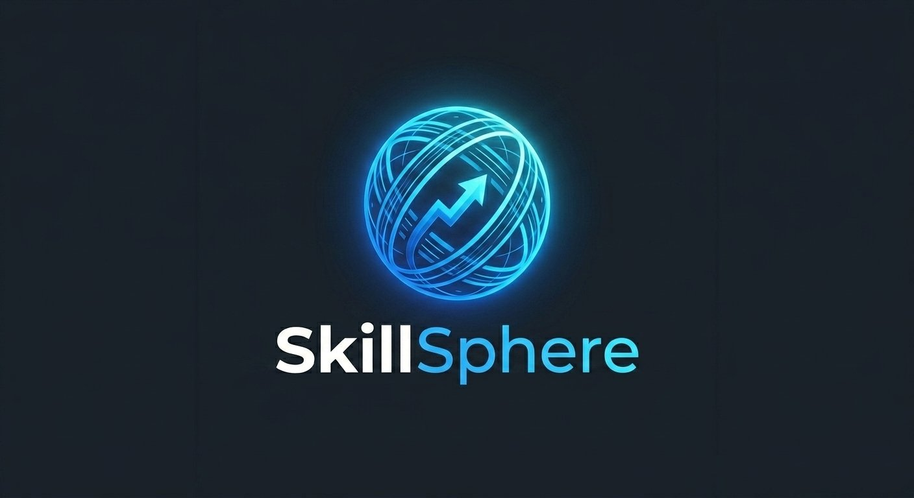

# 🎓 SkillSphere – Modern Online Learning Platform

  
Empowering students to bridge the gap between learning and industry expertise.

**Repository Link:** https://github.com/Galib-272/Assignment-8.git  
**Live Link:** https://skillsphere-learning.vercel.app

---

SkillSphere is a cutting-edge, responsive e-learning platform designed to empower students. Whether you're looking to master Web Development, Design, or Marketing, SkillSphere provides the tools and environment to upgrade your skills today.

## 🚀 Key Features

- **🔐 Advanced Authentication:** Integrated with **BetterAuth**, supporting traditional Email/Password registration and **Google Social Login** with secure environment variable handling.
- **📚 Course Explorer:** Browse a dynamic library of courses with real-time search functionality by title.
- **🛡️ Protected Routes:** Secure access to Course Details—only authorized students can view curriculum and private content.
- **👤 Student Profiles:** Personalized "My Profile" page where users can manage their data and update their Name and Avatar URL.
- **📱 Fully Responsive:** Optimized for a seamless experience across Mobile, Tablet, and Desktop using Tailwind CSS.
- **⚡ Smooth UX:** Implementation of **Motion (Framer Motion)** for animations and **React Hot Toast** for instant feedback.

---

## 🛠️ Tech Stack

- **Framework:** [Next.js 15 (App Router)](https://nextjs.org/)
- **Styling:** [Tailwind CSS](https://tailwindcss.com/) & [HeroUI / DaisyUI](https://www.heroui.com/)
- **Authentication:** [BetterAuth](https://better-auth.com/) (Google OAuth + Email/Password)
- **Animations:** [Motion (Framer Motion)](https://www.framer.com/motion/)
- **Icons & Notifications:** [Lucide React](https://lucide.dev/) & [React Hot Toast](https://react-hot-toast.com/)
- **Deployment:** [Vercel](https://vercel.com/)

---

## 📦 NPM Packages Used

- `better-auth`
- `framer-motion`
- `react-hot-toast`
- `lucide-react`
- `clsx` & `tailwind-merge`

---

## 🛠️ Installation & Local Setup

To run SkillSphere locally, follow these steps:

1. **Clone the repository:**
   ```bash
   git clone https://github.com/Galib-272/Assignment-8.git
   cd Assignment-8
   ```

2. **Install dependencies:**
   ```bash
   npm install
   ```

3. **Configure Environment Variables:**  
   Create a `.env.local` file in the root directory and add your credentials:
   ```env
   BETTER_AUTH_SECRET=your_auth_secret
   BETTER_AUTH_URL=http://localhost:3000

   GOOGLE_CLIENT_ID=your_google_client_id
   GOOGLE_CLIENT_SECRET=your_google_client_secret
   ```

4. **Run the development server:**
   ```bash
   npm run dev
   ```
   Open http://localhost:3000 to view the app.

---

## 📂 Project Structure

- `app/` - Next.js App Router (Routes: Home, Courses, Auth, Profile)
- `components/` - Reusable UI components (Navbar, Footer, CourseCards)
- `lib/` - Auth configuration and utility functions
- `public/` - Static assets and local JSON data structure

---

## 🌟 Challenges Overcome

- **Search Logic:** Implemented a client-side filtering system on the "All Courses" page allowing users to find specific skills instantly by title.

- **Profile Synchronization:** Utilized the updateUser feature from BetterAuth to allow real-time updates to user metadata (Image and Name).

- **Global Deployment:** Successfully configured Google Cloud Console to handle multiple redirect URIs for both Localhost and Vercel production environments.

---

## 📜 License & Copyright

© 2026 Syed Ahmad Galib. All rights reserved.

This project was built to demonstrate real-world full-stack development skills using modern industry-standard tools and technologies.